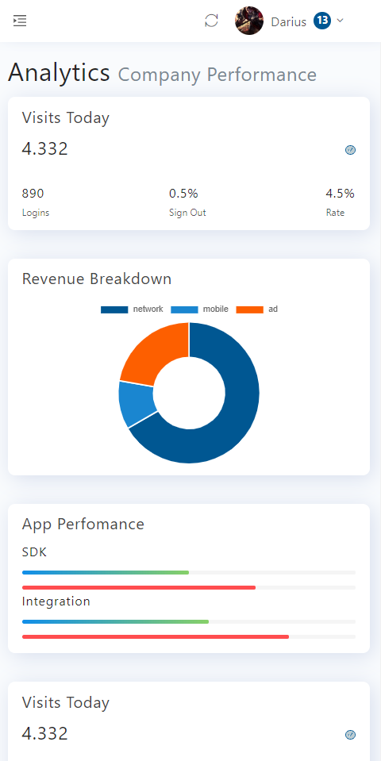

## rzx-react-admin

>react后台模板，基于ant-design,适合入门学习，基本涉及所有react知识点
## QuickStart

```
# 克隆项目
git clone https://github.com/rzx007/rzx-react-admin.git

# 进入项目目录
cd rzx-react-admin

# 安装依赖
npm install

# 建议不要直接使用 cnpm 安装以来，会有各种诡异的 bug。可以通过如下操作解决 npm 下载速度慢的问题
npm install --registry=https://registry.npm.taobao.org

# 启动服务
npm run start


```
Runs the app in the development mode.<br />
Open [http://localhost:3000](http://localhost:3000) to view it in the browser.


## Build
```
# build for production environment
npm run build
```

Builds the app for production to the `build` folder.<br />
It correctly bundles React in production mode and optimizes the build for the best performance.

## 

## Demo


`适配移动端`
