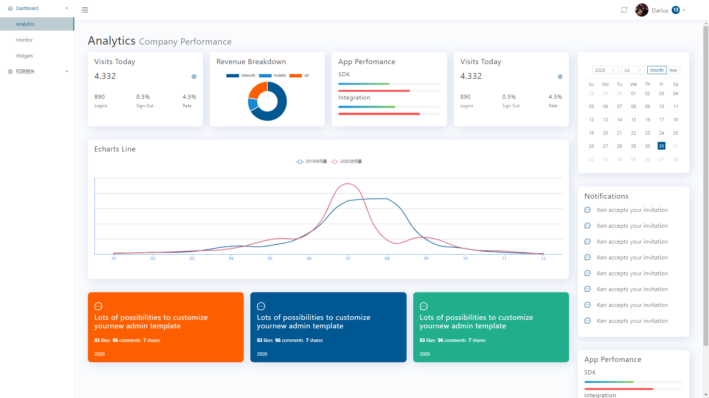
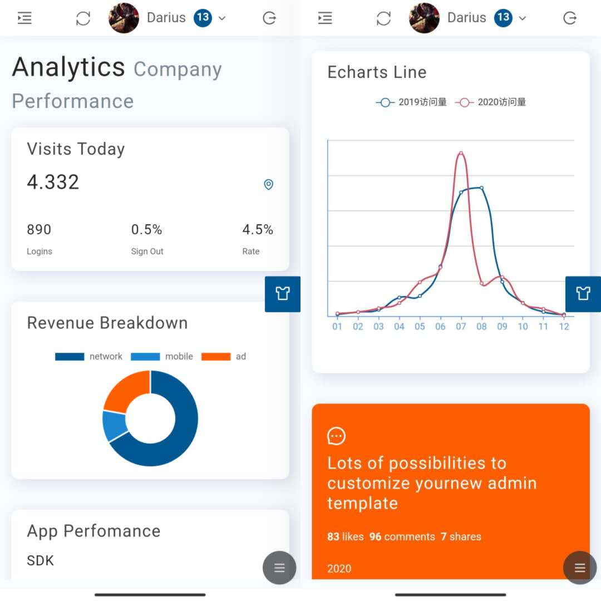
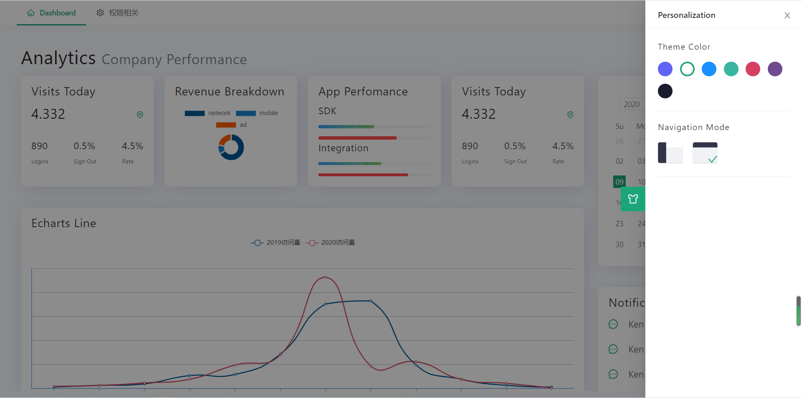

## Best-React-Ui-Template

>react后台模板，基于ant-design,适合入门学习，基本涉及所有react知识点
>模板借鉴了Ant Design Pro风格

## QuickStart

```
# 克隆项目
git clone https://github.com/rzx007/Best-React-Ui-Template.git

# 进入项目目录
cd rzx-react-admin

# 安装依赖
npm install

# 建议不要直接使用 cnpm 安装以来，会有各种诡异的 bug。可以通过如下操作解决 npm 下载速度慢的问题
npm install --registry=https://registry.npm.taobao.org

# 启动服务
npm run start


```
Runs the app in the development mode.<br />
Open [http://localhost:3333](http://localhost:3333) to view it in the browser.


## Build
```
# build for production environment
npm run build
```

Builds the app for production to the `build` folder.<br />
It correctly bundles React in production mode and optimizes the build for the best performance.

## 技术栈

`redux` `react-redux` `react-router-dom` `echarts-for-react` `react-color` `antd`

## 截图

#### 适配移动端，对移动端的表现做了部分优化



## 主题切换功能

使用官方`antd-theme-webpack-plugin`插件，具体配置查阅官方配置
自定义样式使用`css`变量 通过  
`document.body.style.setProperty('--basic-color', localTheme);`
灵活设置变量名称，注意:低版本得IE不支持`css`变量
